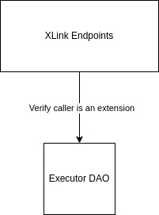

# XLink Contracts Technical Documentation

XLink is deployed and functioning within the Stacks blockchain network. Its main goal is to provide a bridging mechanism, allowing to transfer different tokens between Bitcoin or EVM-like chains and Stacks network. It is the purpose of this document to give the reader a high-level overview of the different modules that constitute the XLink ecosystem and how some of the contracts interact.

## Main Features

The XLink ecosystem offers three main features that are implemented along different contracts. These are:

- The **bridging of BTC**: transferring BTC from the Bitcoin blockchain into the Stacks chain, where they will be represented as wrapped BTC (aBTC) and the other way around.
- The **bridging of BRC-20 assets**: transferring assets that comply with the BRC-20 standard from the Bitcoin chain into the Stacks chain and back.
- The **bridging of EVM-like blockchain's assets**: this feature allows the transferring of assets back and forth between Stacks and several different blockchains that function based on the Ethereum Virtual Machine.

### BTC Bridge (Bitcoin BTC &harr; Stacks aBTC)

 

<small> This is a simplified representation on the BTC Bridge main goal. </small>
<small> \* To see more information on this contract see the [auxiliary contracts section](#Auxiliary-Contracts).</small>

#### BTC Peg-In Endpoint

- Contract name: `btc-peg-in-endpoint-v2-03`
- [Complete technical documentation](btc-peg-in-endpoint-v2-03.md)

This endpoint is the responsible for managing the bridging of BTC from Bitcoin chain into Stacks chain as wrapped BTC (aBTC). For full information see the complete technical documentation.

#### BTC Peg-Out Endpoint

- Contract name: `btc-peg-out-endpoint-v2-01`
- [Complete technical documentation](btc-peg-out-endpoint-v2-01.md)

This endpoint is the responsible for managing the bridging of Stacks' aBTC back into Bitcoin BTC. For full information see the complete technical documentation.

### Meta Bridge (Bitcoin BRC-20 &harr; Stacks SIP-010)

 

<small> This is a simplified representation on the Meta Bridge main goal. </small>
<small> \* To see more information on these contracts see the [auxiliary contracts section](#Auxiliary-Contracts).</small>

#### Meta Peg-In Endpoint

- Contract name: `meta-peg-in-endpoint-v2-02`
- [Complete technical documentation](meta-peg-in-endpoint-v2-02.md)

This endpoint main responsibility the bridging of assets in the Bitcoin chain that follow the BRC-20 standard into the Stacks chain as a specific token that complies with the SIP-010 standard. For full information see the complete technical documentation.

> **Observation**: when BRC-20 tokens are transferred to Stacks chain, the user may also opt to perform a swap to obtain a different token than the original one. In this case, the module delegates the Cross Bridge Module the responsibility to execute this.

#### Meta Peg-Out Endpoint

- Contract name: `meta-peg-out-endpoint-v2-03`
- [Complete technical documentation](meta-peg-out-endpoint-v2-03.md)

This endpoint is responsible for managing the bridging of different tokens from Stacks and back to Bitcoin blockchain, aiming to turn them into BRC-20 assets.

### Cross Bridge (EVM Chains' Tokens &harr; Stacks' SIP-010)

<small> This is a simplified representation on the Cross Bridge main goal. </small>
<small> \* To see more information on these contracts see the [auxiliary contracts section](#Auxiliary-Contracts).</small>

#### Cross Peg-In Endpoint

- Contract name: `cross-peg-in-endpoint-v2-03`
- [Complete technical documentation](cross-peg-in-endpoint-v2-03.md)

This endpoint is responsible for managing the transfer of assets from other EVM-like blockchains into the Stacks chain.

#### Cross Peg-Out Endpoint

- Contract name: `cross-peg-out-endpoint-v2-01`
- [Complete technical documentation](cross-peg-out-endpoint-v2-01.md)

This endpoint is responsible for managing the transfer of SIP-010 bridged tokens from the Stacks network to EVM-like blockchains.

### Auxiliary Contracts

These contracts do not include the implementation of any core functionality but they serve as a support for other contracts to facilitate calculations and common storage management.

- **BTC Bridge Registry**: when a user wants to bridge BTC from Bitcoin chain into Stacks' aBTC or the other way around, this contract keeps record of the generated orders and their statuses, allowing those who interact with it to consult a bridging operation validity and update the records as well.

- **Meta Bridge Registry**: this registry contains information about the approved tokens for bridging. It allows other modules to validate whether the BRC-20 token can be bridged into Stacks.

- **Cross Bridge Registry**: this registry allows other contracts to validate, among other things, if a specific token (from an EVM-like chain) can be bridge into Stacks. It also keeps record of the created bridging orders and their statuses.
- **Cross Router**: this contract is used to verify that a route between two tokens that gives as an output at least the expected minimum amount when swapping exists. It can, certainly, include more than one intermediate path to reach the desired token, meaning that if a user wants to swap token A to obtain token C, there may be some intermediate swaps needed such as `token A -> token B -> token C`(this is related to the existance or not of pools that includes the tokens of interest).

- **Bridge Common Auxiliary Functions**: this contract provides common helper functions to all the others. This auxiliary functions facilitate order creation, transaction decoding, and cross-chain routing validations.
- **Clarity Bitcoin**: this contract contains auxiliary functions that allows its user to interpretate Bitcoin transactions and their content from a buffer.

## XLink Staking

XLink also offers users the possibility to stake their tokens. To see detailed information on how the staking protocol works refer to [xlink-staking](xlink-staking.md).

## Governance

 

At the top of the on-chain architecture is the XLink DAO, accounting for XLink's governance in a rule-based, modular and flexible manner. Built upon Marvin Janssen's ExecutorDAO project, it operates based on the following core principles:

- Proposals are smart contracts.

- The core executes, the extensions give form.

- Ownership control happens via sending context.

For technical details on the ExecutorDAO, refer to the project's [README.md](https://github.com/MarvinJanssen/executor-dao#readme).
