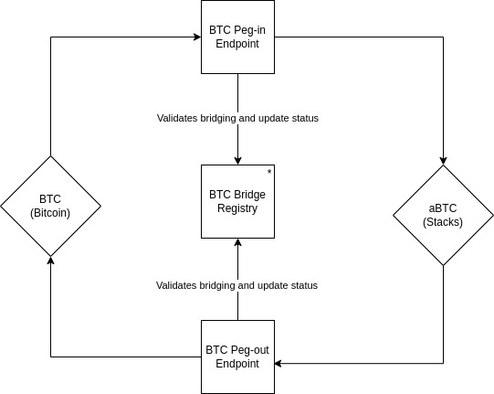
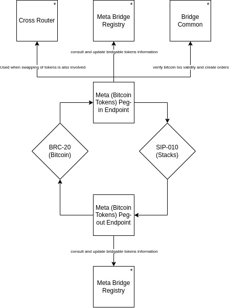
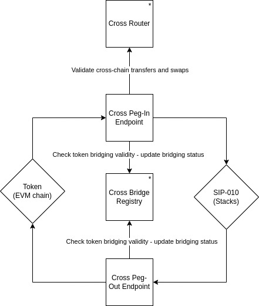

# XLink Contracts Technical Documentation

XLink core functionalities are contained in contracts deployed within the Stacks blockchain network. Its main goal is to provide a bridging mechanism, allowing the transfer of different tokens between Bitcoin or EVM-like chains and Stacks network. The possibility to add token swaps to the bridging processes are offered to the users as well.
It is also worth mentioning that XLink has a staking feature available for the users and a Governance System that allows certain ecosystem decisions to be made together. 
The purpose of this document is to give the reader a high-level overview of the different modules that constitute the XLink ecosystem and how some of the contracts interact.

## Main Features

The XLink ecosystem offers three main features that are implemented along different contracts. These are:

- The **bridging of BTC**: this feature allows the transfer of BTC from the Bitcoin blockchain into the Stacks chain, where it will be represented as bridged BTC (aBTC) and the other way around.
- The **bridging of BRC-20 assets**: this feature allows the transfer of assets that comply with the BRC-20 standard from the Bitcoin chain into the Stacks chain and vice versa.
- The **bridging of EVM-like blockchain's assets**: this feature allows the transfer of assets back and forth between Stacks and several different blockchains that function based on the Ethereum Virtual Machine.

### BTC Bridge (Bitcoin's BTC <-> Stacks' aBTC)

\*To see more information on this contract see the [auxiliary contracts section](#auxiliary-contracts).

#### BTC Peg-In Endpoint

- Contract name: `btc-peg-in-endpoint`
- [Complete technical documentation](btc-peg-in-endpoint.md)

This endpoint is responsible for managing the bridging of BTC from Bitcoin chain into Stacks chain as bridged BTC (aBTC).

#### BTC Peg-Out Endpoint

- Contract name: `btc-peg-out-endpoint-v2-01`
- [Complete technical documentation](btc-peg-out-endpoint-v2-01.md)

This endpoint is responsible for managing the bridging of Stacks' aBTC back to the Bitcoin blockchain as BTC.

### Meta Bridge (Bitcoin's BRC-20 <-> Stacks' SIP-010)

\*To see more information on these contracts see the [auxiliary contracts section](#auxiliary-contracts).</small>

#### Meta Peg-In Endpoint

- Contract name: `meta-peg-in-endpoint-v2-02`
- [Complete technical documentation](meta-peg-in-endpoint-v2-02.md)

This endpoint's main responsibility the bridging of assets in the Bitcoin chain that follow the BRC-20 standard into the Stacks chain as a specific token that complies with the `SIP-010` standard.

> **Observation**: when BRC-20 tokens are transferred to Stacks chain, the user may also opt to perform a swap to obtain a different token than the original one. In this case, the module delegates to the Cross Bridge Module the responsibility to execute the exchange.

#### Meta Peg-Out Endpoint

- Contract name: `meta-peg-out-endpoint-v2-03`
- [Complete technical documentation](meta-peg-out-endpoint-v2-03.md)

This endpoint manages the bridging of tokens from the Stacks chain back to the Bitcoin blockchain, where they are converted into BRC-20 assets.

### Cross Bridge (EVM Chains' Tokens <-> Stacks' SIP-010)

\*To see more information on these contracts see the [auxiliary contracts section](#auxiliary-contracts).</small>

#### Cross Peg-In Endpoint

- Contract name: `cross-peg-in-endpoint-v2-03`
- [Complete technical documentation](cross-peg-in-endpoint-v2-03.md)

This endpoint is responsible for managing the transfer of assets from other EVM-like blockchains into the Stacks chain, where they are represented as `SIP-010` tokens. Sometimes, it also involves swapping to other tokens as part of the peg-in process.

#### Cross Peg-Out Endpoint

- Contract name: `cross-peg-out-endpoint-v2-01`
- [Complete technical documentation](cross-peg-out-endpoint-v2-01.md)

This endpoint is responsible for managing the transfer of `SIP-010` bridged tokens from the Stacks network to EVM-like blockchains.

### Auxiliary Contracts

These contracts do not include the implementation of any core functionality but they serve as a support for other contracts to facilitate calculations and common storage management.

- **BTC Bridge Registry**: when a user wants to bridge BTC from Bitcoin chain into Stacks' aBTC or the other way around, this contract keeps record of the generated orders and their statuses, allowing those who interact with it to consult a bridging operation validity and update the records as well. Its current version can be found at `btc-bridge-registry`.
- **Meta Bridge Registry**: this registry contains information about the approved tokens for bridging. It allows other modules to validate whether the BRC-20 token can be bridged into Stacks. The last version in use can be found at `meta-bridge` file.
- **Cross Bridge Registry**: this registry allows other contracts to validate, among other things, if a specific token (from an EVM-like chain) can be bridged into Stacks. It also keeps record of the created bridging orders and their statuses. The current used version can be found at `cross-bridge-registry` file.
- **Cross Router**: this contract is used to verify that a route between two tokens that gives as an output at least the expected minimum amount when swapping exists. It can, certainly, include intermediate exchanges to reach the desired token, meaning that if a user wants to swap token A to obtain token C, there may be some intermediate swaps needed such as `token A -> token B -> token C`(this is related to the existence or not of pools that includes the tokens of interest). It interacts with the `amm-pool-v2-01` contract to perform the swaps. Currently, it can be found at `cross-router` file.
- **Bridge Common**: this contract provides common helper functions to all the others. These auxiliary functions facilitate order creation, transaction decoding, and cross-chain routing validations. Its implementation can be found at `bridge-common` file.
- **Clarity Bitcoin**: this contract contains auxiliary functions that allows its users to interpret Bitcoin transactions and their content from a buffer. It can be found at `clarity-bitcoin` file.

## Governance

At the top of the on-chain architecture is the XLink DAO, accounting for XLink's governance in a rule-based, modular and flexible manner. Built upon Marvin Janssen's ExecutorDAO project, it operates based on the following core principles:

- Proposals are smart contracts.
- The core executes, the extensions give form.
- Ownership control happens via sending context.

For technical details on the ExecutorDAO, refer to the project's [README.md](https://github.com/MarvinJanssen/executor-dao#readme).

## XLink Staking

XLink also offers users the possibility to stake their tokens. To see detailed information on how the staking protocol works refer to [xlink-staking](https://docs.xlink.network/developers/contracts/xlink-staking).
