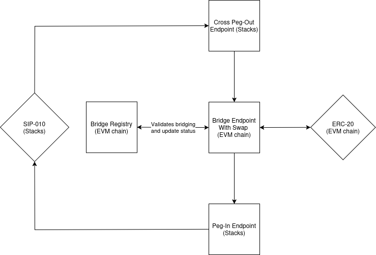

# Technical Documentation for Smart Contracts on Ethereum

This document outlines the main functionalities of the XLink Bridge as deployed on the Ethereum blockchain. The core aspects of the bridging operation are implemented in the `BridgeEndpoint` contract, which acts as the main entry and exit point for cross-chain transactions, ensuring that assets are securely locked, transferred, and released. The `BridgeEndpointWithSwap` contract extends `BridgeEndpoint`, incorporating swaps during bridging. It ensures that a token swap and bridge operation occur in a single transaction.

## Smart Contracts on Ethereum

 [BridgeEndpoint.md](BridgeEndpoint.md) 

## Main Features

The XLink ecosystem offers two main features in its Ethereum implementation. These are:
- The **bridging of EVM-like blockchain's assets**: these contracts interact with XLink smart contracts on Stacks to allow the transfer of assets back and forth between EVM-compatible blockchains and Stacks. 
- The **swapping of tokens in the bridging process** via external liquidity aggregators.

### EVM Chain Bridge

\*To see more information on these contracts see the [auxiliary contracts section](#auxiliary-contracts).</small>

#### Bridge Endpoint

- Contract names: `BridgeEndpoint`, `BridgeEndpointWithSwap`.
- [Complete technical documentation](BridgeEndpoint.md)

This endpoint's main responsibility is serving as the entry and exit point for assets moving along the Cross Chain Bridge. Sometimes, it also involves swapping to other tokens as part of the peg-in process.

### Auxiliary Contracts

These contracts do not include the implementation of any core functionality but they serve as a support for other contracts to facilitate calculations and common storage management.

- **Bridge Registry**: when a user wants to bridge aBTC from the Stacks chain into an EVM chain, or the other way around, this contract keeps record of the generated orders and their statuses, allowing those who interact with it to consult a bridging operation validity and update the records as well. It also manages token and validator approvals. Its current version can be found at `BridgeRegistry`.

