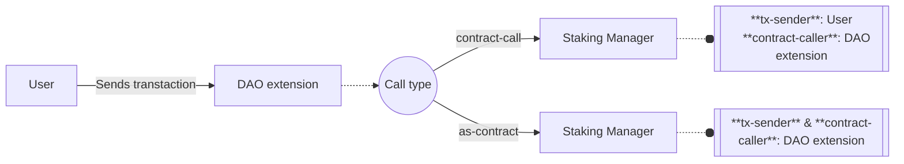
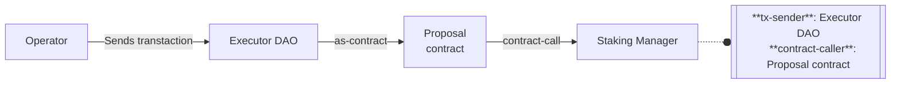

# xlink-staking

- Location: `xlink-dao/contracts/aux/xlink-staking.clar`
- [Deployed contract](https://explorer.stxer.xyz/txid/SP673Z4BPB4R73359K9HE55F2X91V5BJTN5SXZ5T.xlink-staking)

The `xlink-staking` contract, also known as the **XLink Staking Manager**, is designed to manage liquid staking pools for multiple tokens and track staker positions within each pool. It holds users' staked funds, while the actual staking execution and reward reinvestment processes are managed off-chain by XLink's infrastructure.

The Staking Manager contract is part of a hybrid, token-agnostic liquid staking management system, that operates alongside off-chain backend and frontend components managed by XLink.

## Liquid staking

The lifecycle of liquid staking pools is based on three main operations:

1. **Staking**. Users deposit tokens into the `xlink-staking` contract, which are staked externally.
2. **Rewards accrual**. Rewards earned through the external staking protocol are periodically restaked, generating automatic compound interest for stakers.
3. **Unstaking**. Users can withdraw their staked tokens, which include accumulated restaked rewards, at any time.

These are the main three features of the `xlink-staking` contract. Each of these has an impact on the contract storage and generates on-chain events, which are listened by the XLink off-chain components to facilitate corresponding external staking operations.

### Shares-based staking

The system utilizes **shares** instead of token amounts to represent users' staking positions. Shares provide a fixed representation of the users' proportional ownership of the total amount staked, which intrinsically grows over time due to the reinvestment of the staking rewards.

## Reward accrual

The account for the restaked rewards is permissionlessly performed by **updaters**, who submit messages signed by **validators**. This action is performed via the [`add-rewards`](#add-rewards) function and it's the core operation of the liquid staking mechanism.

Validators are XLink protocol actors responsible for maintaining the system's integrity and synchronization. In this sense, their role includes generating a **proof** whenever rewards are successfully collected and restaked in the external protocol.

Each proof consists of a signed message indicating the token, the updated total accrued rewards, and a timestamp. Once updaters collect a sufficient number of proofs, they submit these to the Staking Manager to perform a state update.

It is important to note that this operation does not involve shares management. The key state update is the total staked amount in the [`total-staked`](#total-staked) map.

## Stake / Unstake

### Authorization

These operations are exclusively available for **governance** roles, as they are guarded by the [`is-dao-or-extension`](#is-dao-or-extension) function. What does this imply?

The [`stake`](#stake) and [`unstake`](#unstake) functions are designed to be called by a DAO extension acting as the `contract-caller`. Alternatively, in more exceptional cases, the `tx-sender` can be the DAO itself calling through a proposal contract.

This setup implies that end users can only access these features indirectly through intermediary contracts (façade, endpoint, etc.) that must be enabled DAO extensions. The external call from the extension to the `xlink-staking` contract, a.k.a. Staking Manager, can be implemented in two ways, resulting in different authentications for the `tx-sender`, the staker.

In summary, these operations are typically accessed by users through intermediary contracts registered as DAO extensions. However, they can also be directly called by a proposal contract executed by the DAO.

#### End user call

The `as-contract` call type is the most common approach for liquid staking implementations, where the intermediary contract stakes on behalf of users and provides them with a receipt in the form of a new (rebasing) token.

#### Governance call

### Mechanics

In the Staking Manager, the staker is represented by the `tx-sender`. As explained above, depending on the intermediary contract design, the staker may either be an end user or the endpoint/façade acting on behalf of the user. Therefore, every reference to "staker" (or `user`, as defined within the contract) applies to any of these two possibilities.

Upon staking, the shares corresponding to the amount being staked are calculated and stored in the [`user-shares`](#user-shares) map. This is the staking position and represents the user's portion of the total amount staked. During this operation, the amount to stake is transferred from the `tx-sender` to the Staking Manager, and since the total amount staked and total shares increased, the contract updates its internal state to reflect the changes. Refer to the [`stake`](#stake) function for detailed information.

Unstaking performs the inverse operations. It first calculates the shares that correspond to the amount willing to unstake. Then, the unstaked amount is transferred from the Staking Manager to the `tx-sender` and, finally, state upates are performed to decrease user shares, total shares and total amount staked.


Note that both **staking** and **unstaking** operations involve shares management and update the staking status of the involved token across three dimensions: total shares, total amount staked and user's share-based staking position. Staking and unstaking shouldn't affect share's price.


#### Token amount to shares conversion

On every staking and unstaking action, an amount-to-shares conversion is perfomed using the following equation:

$$
\textrm{Shares} = \frac{\textrm{Amount}}{\textrm{Total Staked}} \; \cdot \; \textrm{Total Shares}.
$$

This is how [`get-shares-given-amount`](#supporting-features) function works. The ratio between the total staked amount and the total shares determines the "share price" in token units, i.e., how many tokens one share represents:

$$
\textrm{Price} = \frac{\textrm{Total Staked}}{\textrm{Total Shares}}
$$

Before completing a staking or unstaking operation, these two values are updated in a way that the share price remains constant. In contrast, reward accrual operations modify this price by maintaing total shares constant and incresing the total staked value.

How does the share price remain constant after staking/unstaking operations?

The price formula shows that the share price is the ratio between the staked tokens amount and the shares amount. Staking adds tokens, so to maintain the price, shares are issued at the price before the staking state update. Analogously, unstaking removes tokens, and to preserve the price, shares are burned at the same price as before the unstaking state update.

## Roles

- **Validators**: Trusted entities responsible for maintaining the system's integrity and synchronization. In the context of the XLink Staking Manager, they generate proofs of reward reinvestment on the external staking protocol.
- **Updaters**: Actors resposible for submitting validator proofs to update the total staked value for any token in the system.
- **Governance**: Includes DAO and its enabled extensions. These roles are authenticated via the [`is-dao-or-extension`](#is-dao-or-extension) function. Extensions are authenticated as `contract-caller`, while the DAO is authenticated as the `tx-sender` for proposal execution scenarios.

## Tokens

Each token within the Staking Manager has the following attributes.

- **Implementation contract**: The Stacks principal indicating the token's implementation contract, which needs to be approved in the [`approved-tokens`](#approved-tokens) map.
- **Total staked**: The total staked amount, tracked in the [`total-staked`](#total-staked) map.
- **Accrued rewards**: The total amount of rewards already restaked, tracked in the [`accrued-rewards`](#accrued-rewards) map.
- **Total shares**: The total amount of shares issued for the token, tracked in the [`total-shares`](#total-shares) map.
- **Staker registry**: The record of each staker's shares, where the sum of all staker shares equals the total shares. This ownership is tracked in the [`user-shares`](#user-shares) map.

## Features

### Main operations

These operations are privileged and protected by the [`is-dao-or-extension`](#is-dao-or-extension) function, allowing only governance roles to execute them. However, the [`add-rewards`](#add-rewards) function is more permissive than staking and unstaking, also allowing approved updaters as callers (`tx-sender`).

#### `add-rewards`

Adds accrued staking rewards for a specific token. The function requires a message `{ token: principal, accrued-rewards: uint, update-block: uint }` signed by a sufficient number of approved validators ([`required-validators`](#required-validators)). The message must be proccessed within a block range determined by the `update-block` value and [`block-threshold`](#block-threshold) variable, or it is considered expired.

Actions performed:

- Calculates the difference (`delta`) between the previous and the updated amount of accrued rewards, given by the `accrued-rewards` value of the message. Mints the `delta` amount to the `xlink-staking` contract's balance to account for the new staked amount.
- Updates the [`accrued-rewards`](#accrued-rewards) and [`total-staked`](#total-staked) maps.
- Emits an `"add-rewards"` log with a detailed payload.

##### Parameters

| Name              | Type                                                                              |
| ----------------- | --------------------------------------------------------------------------------- |
| `message`         | `{ token: principal, accrued-rewards: uint, update-block: uint }`                 |
| `token-trait`     | `<ft-trait>`                                                                      |
| `signature-packs` | `list 100 { signer: principal, message-hash: (buff 32), signature: (buff 65) }))` |

#### `stake`

Allows users to stake a specified token amount.

Actions performed:

- Calls `add-rewards` to update the total staked value if needed. Note this is very important since the `total-staked` value of the token is utilized to calculate the shares.
- Calculates `shares` corresponding to the newly stake amount.
- Transfers the specified amount from the `tx-sender` (user) to the `xlink-staking` contract.
- Updates the `user-shares`, `total-shares` and `total-staked` maps.
- Emits a `"stake"` log with a detailed payload (user, token, updated values).

##### Parameters

| Name              | Type                                                                              |
| ----------------- | --------------------------------------------------------------------------------- |
| `token-trait`     | `<ft-trait>`                                                                      |
| `amount`          | `uint`                                                                            |
| `message`         | `{ token: principal, accrued-rewards: uint, update-block: uint }`                 |
| `signature-packs` | `list 100 { signer: principal, message-hash: (buff 32), signature: (buff 65) }))` |

#### `unstake`

Allows users to unstake a specified token amount.

Actions performed:

- As in [`stake`](#stake), calls `add-rewards` to update the total staked value if needed.
- Calculates `shares` corresponding to the amount to unstake.
- Transfers the specified amount from the `tx-sender` (user) to the `xlink-staking` contract.
- Updates the `user-shares`, `total-shares` and `total-staked` map.
- Emits an `"unstake"` log with a detailed payload (user, token, updated values).

##### Parameters

| Name              | Type                                                                              |
| ----------------- | --------------------------------------------------------------------------------- |
| `token-trait`     | `<ft-trait>`                                                                      |
| `amount`          | `uint`                                                                            |
| `message`         | `{ token: principal, accrued-rewards: uint, update-block: uint }`                 |
| `signature-packs` | `list 100 { signer: principal, message-hash: (buff 32), signature: (buff 65) }))` |

### Governance

These features are protected by the [`is-dao-or-extension`](#is-dao-or-extension) function and resticted to the XLink DAO or its enabled extensions.

#### `withdraw`

Withdraws an amount of any approved token and deducts it from the total staked amount. This function serves as an emergecy mechanism designed to adjust protocol values if necessary,
though such a situation is considered rare.

Actions performed:

- Transfers the specified amount from the `xlink-staking` contract to the `tx-sender`.
- Updates the `total-staked` map.
- Emits a `"withdraw"` log and a payload.

##### Parameters

| Name          | Type         |
| ------------- | ------------ |
| `token-trait` | `<ft-trait>` |
| `amount`      | `uint`       |

#### `set-paused`

Sets the [`is-paused`](#is-paused) variable.

##### Parameters

| Name     | Type   |
| -------- | ------ |
| `paused` | `bool` |

#### `set-approved-token`

Sets the approval status of a token within the Staking Manager. Modifies the [`approved-tokens`](#approved-tokens) map.

##### Parameters

| Name       | Type        |
| ---------- | ----------- |
| `token`    | `principal` |
| `approved` | `bool`      |

#### `set-approved-updater`

Sets the approval status of an updater. Modifies the [`approved-updaters`](#approved-updaters) map.

##### Parameters

| Name       | Type        |
| ---------- | ----------- |
| `updater`  | `principal` |
| `approved` | `bool`      |

#### `set-block-threshold`

Sets the [`block-threshold`](#block-threshold) variable.

##### Parameters

| Name        | Type   |
| ----------- | ------ |
| `threshold` | `uint` |

#### `set-accrued-rewards`

Permissionlessly sets the accrued rewards value of a certain `token` key in the [`accrued-rewards`](#accrued-rewards) map. Note this function potentially overwrites the value updatead via the [`add-rewards`](#add-rewards) function.

##### Parameters

| Name      | Type                                   |
| --------- | -------------------------------------- |
| `token`   | `principal`                            |
| `details` | `{ amount: uint, update-block: uint }` |

#### `set-required-validators`

Sets the [`set-required-validators`](#required-validators) variable.

##### Parameters

| Name       | Type   |
| ---------- | ------ |
| `required` | `uint` |

#### `add-validator`

Adds a new `validator` key in the [`validators-registry`](#validators-registry) map. Values cannot be modified if the key already exists, since the the update is performed with the [`map-insert`](https://docs.stacks.co/reference/functions#map-insert) Clarity function.

##### Parameters

| Name        | Type                                      |
| ----------- | ----------------------------------------- |
| `validator` | `principal`                               |
| `details`   | `{ token: principal, pubkey: (buff 33) }` |

#### `remove-validator`

Removes an entry in the [`validators-registry`](#validators-registry) map, using the [`map-delete`](https://docs.stacks.co/reference/functions#map-delete) Clarity function.

##### Parameters

| Name        | Type        |
| ----------- | ----------- |
| `validator` | `principal` |

### Supporting features

#### `is-dao-or-extension`

Standard protocol function to check whether the `contract-caller` is an enabled extension within the DAO or the `tx-sender` is the DAO itself (proposal execution scenario). The enabled extension check is delegated to the XLink's `executor-dao` contract.

#### Staking validation

- `validate-stake`
- `validate-unstake`

#### Shares conversion

- `get-shares-given-amount`
- `get-amount-given-shares`

#### Message handling

- `message-domain`
- `create-oracle-message`
- `decode-oracle-message`
- `hash-oracle-message`

### Getters

Getter functions to retrieve all the [storage](#storage) variables and values within each map. For maps related to validators, an error is thrown if the principal is not present as a key within the [`validators-regitry`](#validators-registry). In contrast, for token maps, a default value is returned if the principal is not found.

#### Variables

- `get-paused`
- `get-block-threshold`
- `get-required-validators`

#### Maps

- `get-validator-or-fail`
- `get-approved-token-or-default`
- `get-shares-or-default`
- `get-total-shares-or-default`
- `get-total-staked-or-default`
- `get-accrued-rewards-or-default`
- `get-approved-updater-or-default`

## Storage

### `is-paused`

| Data     | Type   |
| -------- | ------ |
| Variable | `bool` |

Indicates the operational status of the main contract operations: [`add-rewards`](#add-rewards), [`stake`](#stake) and [`unstake`](#unstake).

### `approved-tokens`

| Data | Type             |
| ---- | ---------------- |
| Map  | `principal bool` |

Maintains a mapping of token contracts (`principal`) to their approval status (`bool`) within the Staking Manager.

### `user-shares`

| Data | Type                                         |
| ---- | -------------------------------------------- |
| Map  | `{ user: principal, token: principal } uint` |

Tracks the number of shares held by each staker (`user`) for a specific `token`.

### `total-staked`

| Data | Type             |
| ---- | ---------------- |
| Map  | `principal uint` |

Tracks the total value staked for each token contract (`principal`).

### `total-shares`

| Data | Type             |
| ---- | ---------------- |
| Map  | `principal uint` |

Tracks the total shares issued for each staking token (`principal`).

### `validators-registry`

| Data | Type                                                |
| ---- | --------------------------------------------------- |
| Map  | `principal { token: principal, pubkey: (buff 33) }` |

Maintains a mapping of the registered validators. Each one is identified by a Stacks `principal` and has associated `token` and public key used for message signature verification.

### `required-validators`

| Data     | Type   |
| -------- | ------ |
| Variable | `uint` |

Indicates the minimum number of validators required to sign a message for it to be considered valid.

### `accrued-rewards`

| Data | Type                                             |
| ---- | ------------------------------------------------ |
| Map  | `principal { amount: uint, update-block: uint }` |

Tracks the total rewards that have been collected and restaked for each token, identified by its contract `principal`. The `update-block` field records the [`stacks-block-height`](https://docs.stacks.co/reference/keywords#stacks-block-height) of the last update. This map plays a key role in the [`add-rewards`](#add-rewards) function mechanism.

### `block-threshold`

| Data     | Type   |
| -------- | ------ |
| Variable | `uint` |

Specifies the number of Stacks blocks allowed as a delay for submitting an [`add-rewards`](#add-rewards) message.

### `approved-updaters`

| Data | Type             |
| ---- | ---------------- |
| Map  | `principal bool` |

Maps updaters (`principal`) to their approval status (`bool`).

### Relevant constants

#### `ONE_8`

| Type   | Value        |
| ------ | ------------ |
| `uint` | `u100000000` |

Mathematical constant used to restrict the decimal precision to 8 digits.

#### `MAX_REQUIRED_VALIDATORS`

| Type   | Value |
| ------ | ----- |
| `uint` | `u20` |

Defines the upper bound for the [`required-validators`](#required-validators) variable.

## Contract calls

- `<ft-trait>`: Interaction with any approved token to perform mint actions ([`add-rewards`](#add-rewards)) and transfers (mostly within [`stake`](#stake) and [`unstake`](#unstake), but also within the [`withdraw`](#withdraw) governance function). The `ft-trait` within the contract is the custom SIP-010 implementation for handling fixed notation, available at `'SP2XD7417HGPRTREMKF748VNEQPDRR0RMANB7X1NK.trait-sip-010`.

- `'SP2XD7417HGPRTREMKF748VNEQPDRR0RMANB7X1NK.executor-dao`: This contract is exclusively called by the [`is-dao-or-extension`](#is-dao-or-extension) function for authorizing governance operations.

## Errors

| Error Name                         | Value         |
| ---------------------------------- | ------------- |
| `err-not-authorised`               | `(err u1000)` |
| `err-paused`                       | `(err u1001)` |
| `err-unknownvalidator`             | `(err u1006)` |
| `err-validator-already-registered` | `(err u1008)` |
| `err-hash-mismatch`                | `(err u1010)` |
| `err-invalid-signature`            | `(err u1011)` |
| `err-message-to-old`               | `(err u1012)` |
| `err-invalid-block`                | `(err u1013)` |
| `err-required-validators`          | `(err u1015)` |
| `err-invalid-validator`            | `(err u1016)` |
| `err-invalid-input`                | `(err u1017)` |
| `err-token-mismatch`               | `(err u1018)` |
| `err-invalid-amount`               | `(err u1019)` |
| `err-update-failed`                | `(err u1020)` |
| `err-duplicated-signatures`        | `(err u1021)` |

<!-- Documentation Contract Template v0.1.1 -->
