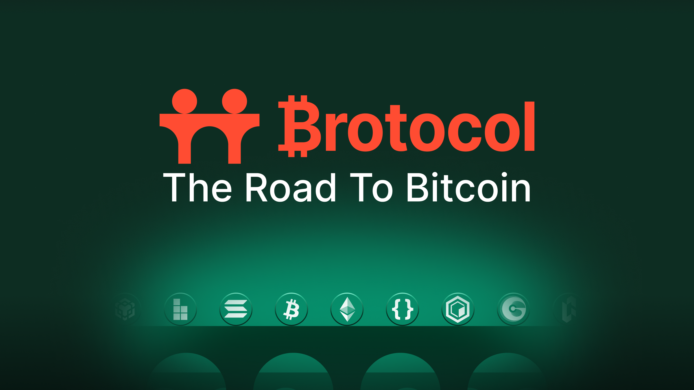
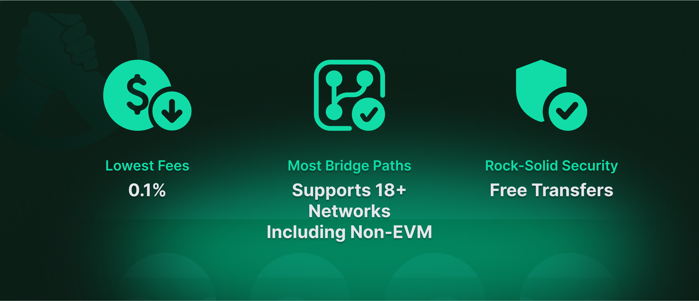
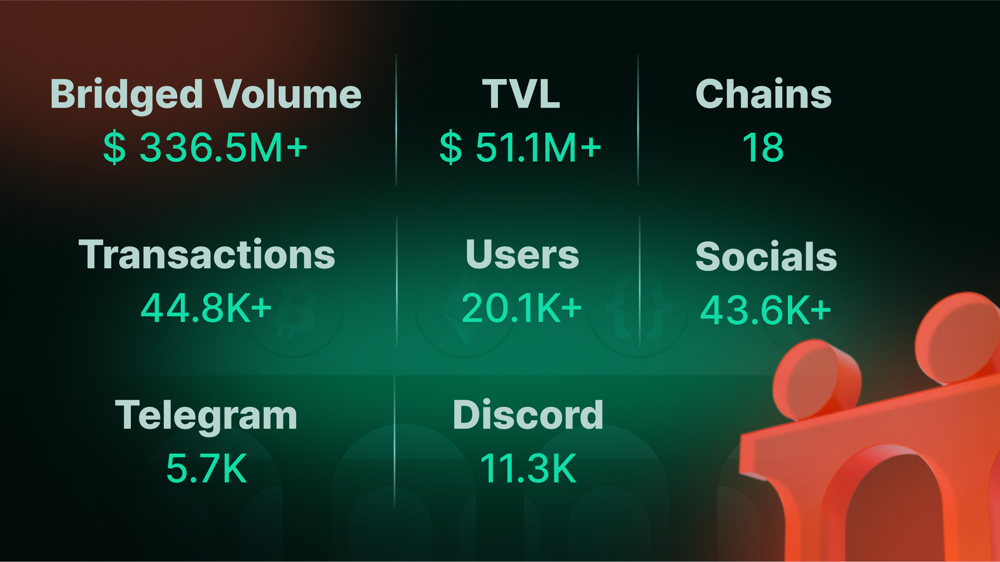
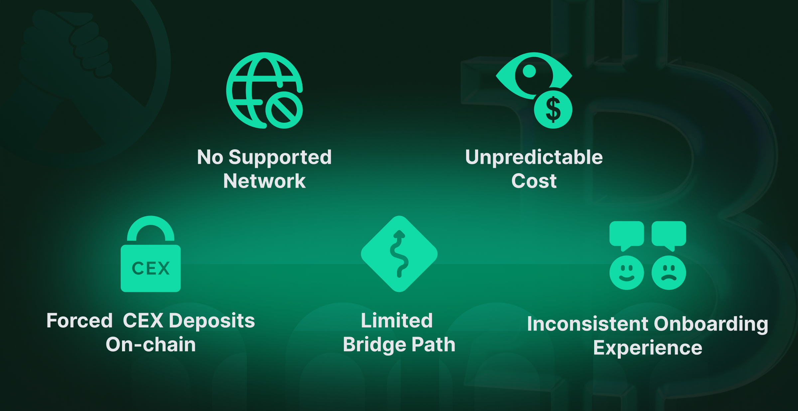
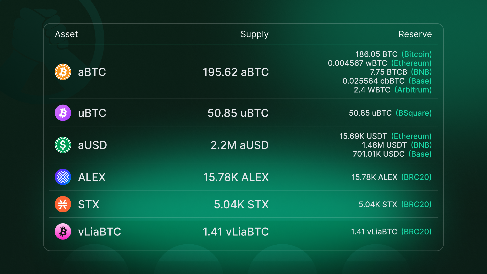

# ✨ Brotocol 101

With L1s and L2s multiplying, Brotocol makes cross-chain bridging simple, affordable, and secure—no matter your preferred blockchain. Get the **best rates** with Brotocol Bridge!

<figure><figcaption></figcaption></figure>

### What is Brotocol?

Brotocol [BroBridge](../features/brobridge/README.md) is a **MPC-based hybrid bi-directional bridge** that acts as a '**connector**' between Bitcoin and other blockchains, enabling anyone to move between chains beyond the limitation of just EVM-based bridges.

### Why Brotocol?

<figure><figcaption></figcaption></figure>

Bridging shouldn’t suck—high fees and sketchy paths are out. Brotocol’s your **crypto bro**, offering:

* **Lowest Fees:** Just **0.1%** to bridge native Bitcoin to EVM chains.
* **Most Bridge Paths:** Supports **18+ networks**, including non-EVM.
* **Rock-Solid Security:** MPC-based for stress-free transfers.
* **Seamless Swaps Across Chains:** Allowing users to swap to any assets from native Bitcoin to EVM tokens back and forth.&#x20;

### Brotocol’s Rate is Unbeatable!

If you are bridging 1 $BTC—how much do you keep, let’s see the table below:

<figure><figcaption></figcaption></figure>

_**🔴:** No direct bridge but requires the use of CEX deposit/withdrawal and does not include withdrawal fees_

Beyond the savings, Brotocol has the most BTC-friendly route possible!

<figure><figcaption></figcaption></figure>

### How does Brotocol Work?

When you want to move assets (like Bitcoin) from one network to another, Brotocol handles the process, making sure everything happens securely.

**Here’s how it work:**

* You start by deciding how much you want to bridge on our UI (e.g: Native $BTC → Arb’s $WBTC)
* We lock that amount in a multisig wallet.
* Once network confirmed, our validators unlock the equivalent on your target chain (e.g., $WBTC on Arbitrum).
* Done—You pay 0.1% fee once.

### Brotocol by the Numbers!

<figure><figcaption></figcaption></figure>

**Here are Brotocol numbers by the numbers (As of 25th March):**

* **Total Bridged Volume:** $336.5M+
* **TVL:** $51.1M+
* **Supported Chains:** 18
* **Total Bridge TXs:** 44.8K+
* **Unique User Counts:** 20.1K+

> **Do you know?** The ALEX Multichain Launchpad uses Brotocol which helps anyone to participate in IDO in a click without the need to do manual bridging!

### Bridge Challenges Today

<figure><figcaption></figcaption></figure>

* **Limited Network Support:** Most centralized exchanges (CEXs) don’t support depositing $WBTC on Arbitrum or other low-TVL EVM chains, reducing liquidity and options.
* **High and Unpredictable Costs:** Moving $BTC across EVM and non-EVM chains is expensive and inconsistent due to fees (bridging, swapping, withdrawals) and liquidity issues.
* **Complex CEX Workarounds:** Users must either bridge Arbitrum’s $WBTC to Ethereum’s $WBTC and deposit/withdraw via CEX, or swap to $ETH, deposit, trade, and withdraw—both costly and often requiring KYC.
* **Lack of Bridge Options:** Popular bridges (e.g., Wormhole, Stargate) rarely offer consistent paths between chains like Arbitrum, BNB, or Ethereum for $BTC variants.
* **Poor User Experience:** Different $BTC versions vary in support, cost, and ease of movement, creating a confusing and inefficient onboarding process that limits chain adoption.

<figure><figcaption></figcaption></figure>

Let’s take Arbitrum’s $WBTC as a quick example.

Arbitrum’s $WBTC moves **$1.3B/month** on Uniswap and holds **$243M** in Aave deposits (March 25, 2025). Bridging it to native BTC? A mess—until Brotocol:

* **Old Way:** CEX swaps, high fees, or no paths.
* **Brotocol Way:** 0.1% fee, direct to BTC, 18+ chain options.

Demand for EVM BTC is huge—Brotocol makes it flow.

### Brotocol’s Proof of Reserve & Audits

To check Brotocol’s Proof of Reserve, you can visit here: [https://brotocol.xyz/bridge/reserve](https://brotocol.xyz/bridge/reserve)

<figure><figcaption></figcaption></figure>

All Brotocol audits are available here: [**Brotocol Audit Reports**](../../developers/security-audits.md)
