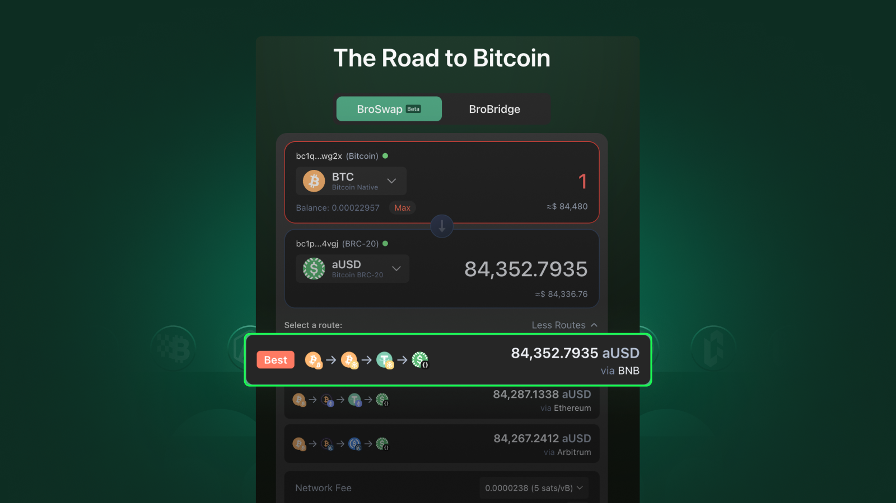

# BroSwap

<figure><figcaption></figcaption></figure>

With BroSwap, you would initiate a swap directly from your Bitcoin wallet to any assets you would like to swap to.

**BroSwap currently supports:**

* Bitcoin native network
* BRC-20
* Runes

Swap from BTC to aUSD (Wrapped version of USDT) back and forth or even purchase Runes with stables (aUSD)!

If you haven't try BroSwap, try it now here: [https://brotocol.xyz/bitcoin/swap](https://brotocol.xyz/bitcoin/swap)

## Explore

 [key-concepts.md](key-concepts.md) 
 [how-to-swap.md](how-to-swap.md) 
 [how-to-swap-non-bridgeable-tokens.md](how-to-swap-non-bridgeable-tokens.md) 
<!--  [faqs.md](faqs.md)  -->

## Support

For assistance, please reach out to our Community Managers on [Discord](https://discord.gg/brotocol).