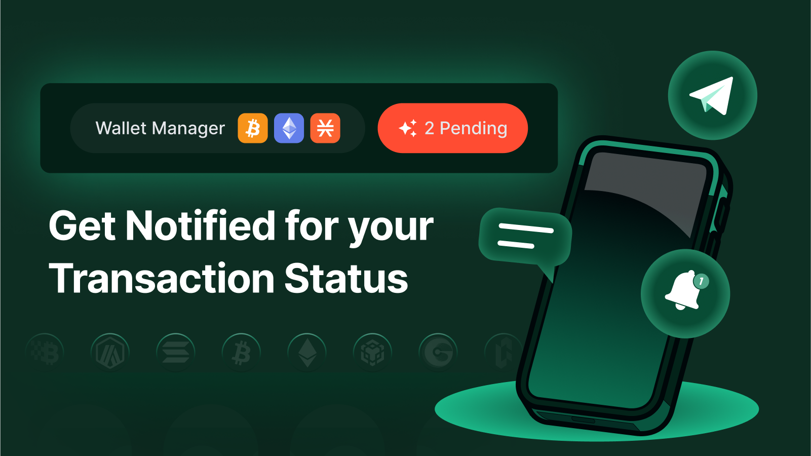

# Active Notifications

<figure><figcaption></figcaption></figure>

Not all chains are lightning fast—especially for those unfamiliar with Bitcoin’s native network speed, transactions may take some time to complete.

But fret not! Brotocol includes **active notifications** to keep you informed about ongoing transactions in real time.

<figure><figcaption></figcaption></figure>

If you have at least one pending notification, your '[**Explorer**](broken-reference)' button will be updated to look like the screenshot above.&#x20;

<figure><figcaption></figcaption></figure>

By clicking 'My records only', you will be able to see the status of your transaction.&#x20;

