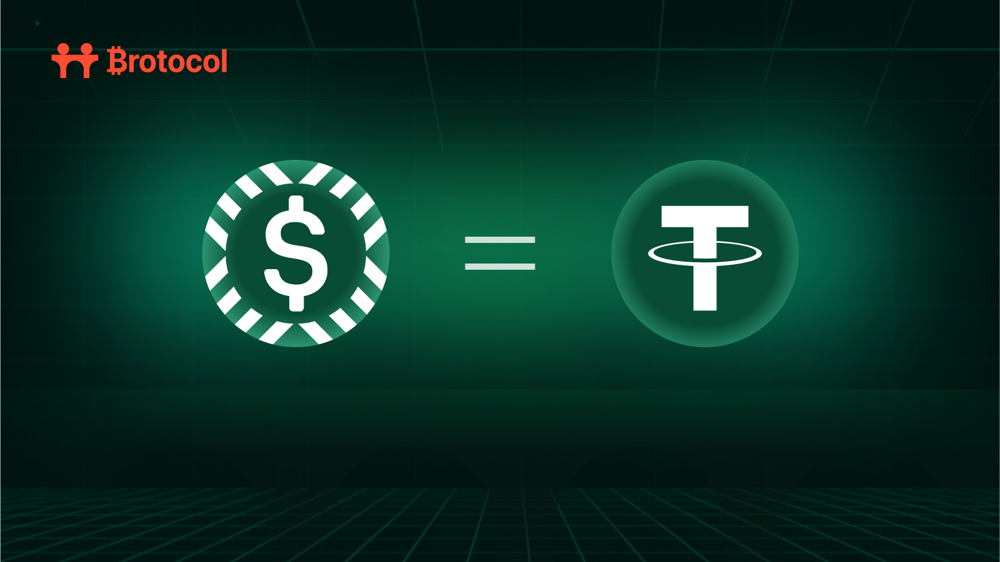

# What is aUSD?

<figure><figcaption></figcaption></figure>

## aUSD: Bridging Bitcoin to Stablecoin Liquidity in the Brotocol Ecosystem

As Bitcoin continues its journey toward becoming the center of the DeFi ecosystem, one critical component has been missing: seamless access to stablecoin liquidity directly from Bitcoin wallets.&#x20;

With the upcoming launch of BroSwap, Brotocol introduces aUSD, a fully-backed synthetic stablecoin designed to serve as the foundational base asset for BTC/USD trading—creating an immediate bridge between Bitcoin and the global stablecoin ecosystem.

### What is aUSD?

aUSD is a synthetic stablecoin issued by Brotocol with a 1:1 backing from established stablecoins USDT and USDC.&#x20;

This innovative asset exists across multiple chains, including Bitcoin (as the BRC20 token "AUSD$"), providing users with a consistent and reliable USD-pegged asset regardless of which blockchain they're using.

The core value proposition of aUSD lies in its ability to create immediate stablecoin liquidity on Bitcoin without waiting for major stablecoin issuers to deploy natively.&#x20;

This approach aligns perfectly with Brotocol's philosophy of bringing DeFi functionality to Bitcoin rather than forcing Bitcoin users to leave their preferred ecosystem.

Like its companion asset aBTC, which connects native Bitcoin with wrapped Bitcoin versions across chains, aUSD creates a standardized synthetic asset that connects to various stablecoins while maintaining Bitcoin as the home base.

### How aUSD Works: Robust Security and Reserve Management

aUSD maintains a full 1:1 backing with reserve assets held by institutional-grade custodians. The reserve structure includes:

* USDT on Ethereum
* USDT on BSC
* USDC on Base
* USDC on Arbitrum

These reserves are secured through multiple layers of protection:

1. **Institutional-Grade Custody**: Reserve assets are held by established custodians including Fireblocks and Cobo, utilizing advanced MPC wallet technology
2. **Transparent Reserve Reporting**: Up-to-date reserve figures are publicly available at [brotocol.xyz/reserves](https://www.brotocol.xyz/reserves)
3. **Cross-Chain Integrity**: When aUSD moves between chains, the token is burned on the source chain and minted on the destination chain, maintaining consistent total supply
4. **Decentralized Validation**: Bonbori, Brotocol's validator network, ensures secure cross-chain operations

On Bitcoin, aUSD exists as "AUSD$", a BRC20 token deployed using the self-mint mechanism. While the BRC20 standard theoretically supports dynamic minting and burning, operational challenges have led Brotocol to pre-mint AUSD$ tokens, with the majority held in secure cold storage at ChainUp and smaller amounts in warm and hot wallets to facilitate smooth cross-chain operations.

### aUSD as the Foundation for BroSwap's Launch

When BroSwap launches, aUSD will serve as the critical base asset that enables immediate trading between Bitcoin and stablecoins without requiring Bitcoin users to leave their native environment. This approach delivers several key benefits:

#### 1. Immediate BTC/USD Liquidity

Rather than waiting for stablecoin issuers to deploy natively on Bitcoin, aUSD provides day-one access to deep stablecoin liquidity. From launch, Bitcoin users will be able to trade BTC to and from AUSD$ directly from their Bitcoin wallets, with BroSwap's architecture connecting to established liquidity pools across multiple chains.

#### 2. Seamless Cross-Chain Connectivity

aUSD serves as the connectivity asset that enables fungible movement between stablecoin ecosystems. When a user swaps BTC for AUSD$ on BroSwap, the system can utilize liquidity from any of the supported reserve assets (USDT on Ethereum, USDC on Base, etc.) while abstracting away the complexity from the user.

#### 3. Foundation for the Bitcoin DeFi Ecosystem

By providing a reliable USD-pegged asset on Bitcoin from day one, aUSD creates a foundation for broader DeFi activities. Bitcoin users can maintain stablecoin exposure without leaving the Bitcoin ecosystem, enabling activities like:

* Hedging BTC volatility
* Trading between BTC and stable value
* Maintaining purchasing power
* Preparing for the broader arrival of DeFi on Bitcoin

### The Pathway to USDT Integration

While aUSD provides immediate stablecoin functionality on Bitcoin, Brotocol recognizes the importance of native stablecoin deployments. The upcoming launch of Tether's USDT on Bitcoin through Taproot assets represents a significant milestone for the ecosystem, and Brotocol has designed aUSD with this transition in mind.

When USDT launches on Bitcoin, Brotocol will immediately integrate it as an aUSD reserve asset. This approach provides several advantages:

1. **Immediate Utility**: Bitcoin USDT will instantly connect to Brotocol's cross-chain infrastructure
2. **Enhanced Liquidity**: USDT on Bitcoin will benefit from connection to existing liquidity pools
3. **Seamless User Experience**: Users can choose between AUSD$ and native USDT based on their preferences
4. **Gradual Transition**: As USDT on Bitcoin gains adoption, users can naturally shift between the assets

In the longer term, BroSwap plans to add direct BTC/USDT trading pairs, giving users the option to trade with either synthetic (aUSD) or native (USDT) stablecoins according to their preferences. This flexibility ensures that Bitcoin users maintain choice while benefiting from the deepest possible liquidity.

### aUSD's Role in Brotocol's Broader Vision

aUSD exemplifies Brotocol's core mission of bringing DeFi functionality to Bitcoin rather than forcing Bitcoin to adapt to existing DeFi paradigms. By creating a synthetic stablecoin that lives natively on Bitcoin while connecting to established stablecoin ecosystems, Brotocol enables Bitcoin users to access stable value without sacrificing sovereignty or security.

This approach complements Brotocol's other core products:

* **BroBridge**: The cross-chain connectivity layer that facilitates aUSD's movement between ecosystems
* **BroSwap**: The DEX that enables trading between BTC and aUSD (among other assets)
* **BroPay**: The payment solution that allows non-Bitcoin users to interact with the Bitcoin ecosystem

Together, these products create a comprehensive infrastructure that positions Bitcoin at the center of the DeFi ecosystem rather than as a peripheral participant.

### Conclusion: Building Bridges to Bitcoin's DeFi Future

aUSD represents a critical bridge between Bitcoin and the broader stablecoin ecosystem—one that enables immediate functionality while paving the way for native solutions like USDT on Bitcoin. By providing Bitcoin users with day-one access to stablecoin liquidity without requiring them to leave their native environment, aUSD removes one of the major barriers that has historically limited Bitcoin's role in decentralized finance.

As the ecosystem evolves and native stablecoins like USDT arrive on Bitcoin, aUSD's role will adapt, continuing to serve as a connectivity layer that brings the best of DeFi to Bitcoin users. This flexible approach ensures that Bitcoin users can access stable value on their own terms, maintaining the security and sovereignty that drew them to Bitcoin in the first place.

In the coming "Bitcoin DeFi Summer," aUSD will play a foundational role in accelerating adoption and enabling new use cases—contributing to Brotocol's vision of a Bitcoin-centric financial ecosystem where "the Road to Bitcoin" leads to a more connected, efficient, and user-friendly experience for all.
