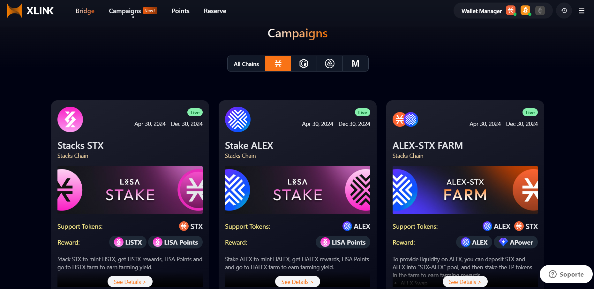

# Campaign Guide

## What are XLink Campaigns

Welcome to the **Campaigns**! XLink campaigns are special events where users can participate in various actions on supported blockchains to earn rewards. These actions typically involve interacting with the XLink bridge, such as staking tokens, adding liquidity, or bridging assets between chains. Campaigns offer great opportunities to earn **ALEX**, **LiSTX**, **XLink Points**, and other project-specific tokens as rewards.

Each campaign may have different requirements and actions to complete, but they all aim to incentivize user participation and enhance Bitcoin DeFi ecosystems. Below, we'll explore the rewards you can earn and some tips on how to maximize your participation.

## How do XLink Campaigns work

Campaigns work by offering users the chance to earn rewards for completing specific tasks across different blockchains. Here's a quick overview:

- **Actions**: Users typically need to perform tasks like staking, adding liquidity, or bridging assets.
- **Rewards**: In return, participants can earn tokens such as **ALEX**, **LiSTX**, **XLink Points**, or project-specific tokens like **aBTC** and **MODE Points**.
- **Platforms**: Campaigns can be hosted on various platforms like CORE, Mode, or Stacks, and often involve bridging assets between blockchains to complete the tasks.

## Typical Rewards in XLink Campaigns

XLink campaigns offer a variety of rewards based on the campaign and the blockchain involved. Here are some common rewards you can earn:

- **ALEX**: Earn ALEX by participating in campaigns on the Stacks or Ethereum blockchains.
- **LiSTX**: A popular reward on Stacks campaigns, allowing users to stake and earn additional tokens.
- **XLink Points**: Earn XLink Points by bridging assets and completing actions.
- **Project-Specific Tokens**: Earn tokens tied to the specific blockchain you're interacting with (e.g., **aBTC**, **MODE Points**).

## Tips for Participating in Campaigns

- **Check the Requirements**: Each campaign has different requirements, so be sure to review the campaign details before you start.
- **Stay Updated**: New campaigns are launched regularly. Keep an eye on the XLink platform or join our community channels for the latest updates.
- **Plan Ahead**: Some campaigns offer better rewards for specific actions (e.g., staking certain tokens or adding liquidity). Plan to maximize your rewards!

## Where to Find Campaigns

To view and join active campaigns, visit the [**XLink Campaigns Page**](https://app.xlink.network/bridge-campaign). You’ll find detailed instructions, the supported tokens, and the rewards for each campaign.

## How to Participate in XLink Campaigns

Participating in campaigns is easy and rewarding. Although each campaign might be slightly different, the basic steps to participate are similar. Here’s how you can get started:

### Step 1: **Register on the Platform**
First, visit the **XLink App** and navigate to the **Campaigns** tab. This is where you'll find all the active campaigns. 

Look for the **See Details** button next to the campaign you're interested in. Clicking it will provide more details on how to participate, including specific steps and links to register.

Once you've selected a campaign, you'll need to register for it by following the instructions provided under the **How to Participate** section. You might be directed to specific platforms like **CORE**, **Mode**, or **Stacks**, depending on the campaign.

For example, in the **ALEX Staking Campaign**, you'll be directed to stake your ALEX tokens on LISA. Follow the campaign-specific instructions to complete the staking process and earn rewards.

For example, in the **ALEX Liquidity Campaign**, you’ll be directed to add liquidity on a supported DeFi platform. Be sure to follow the specific steps outlined in each campaign.
   
### Step 2: **Bridge Your Assets** (If Required)
Next, you’ll typically bridge assets from one blockchain to another, depending on the campaign. This could include tokens like **aBTC**, **WBTC**, or other supported assets. Make sure to check the campaign’s instructions on which assets to bridge and to which chain.

*Note*: Not all campaigns require bridging assets, so always check the campaign details first.

   <!-- *screenshot here showing the bridge interface and how to select assets for bridging.*
    -->

### Step 3: **Complete the Required Action**
Once your assets are bridged, you may need to perform additional actions like re-staking your tokens, adding liquidity to a pool, or borrowing/supplying tokens on a DeFi platform. These actions unlock the campaign rewards.

*Note*: The actions required in each campaign can vary, so be sure to check the campaign details for specific requirements.
  
  <!-- *screenshot here showing an example of completing an action like staking or adding liquidity.* 
   -->

### Step 4: **Earn Rewards**
After completing the necessary steps, you'll start earning rewards like **ALEX**, **LiSTX**, **XLink Points**, or other project-specific tokens.
   
  <!-- *screenshot here showing how rewards are tracked or where users can see their earned rewards.*
   -->

## Need Help?

If you have any questions or need help with a campaign, join our community on [**Discord**](https://discord.com/invite/xlink).
