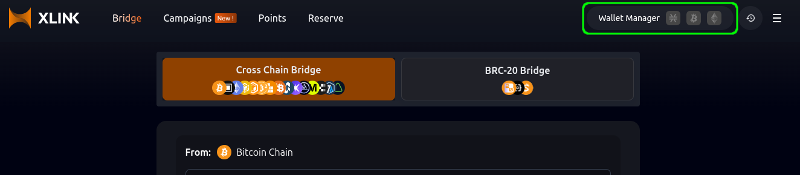
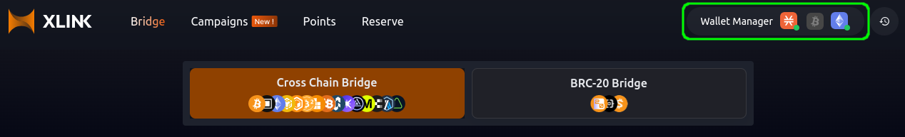
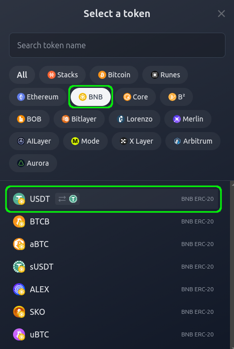
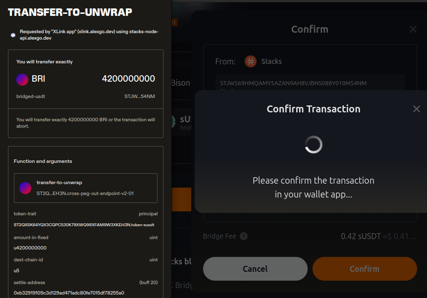
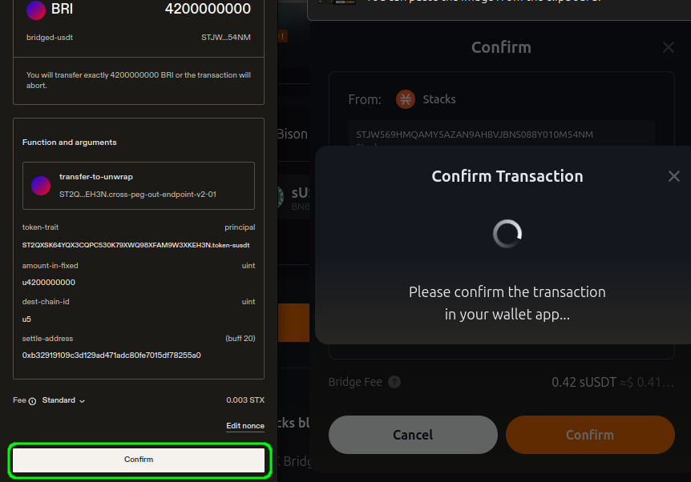

# Quickstart: Using the Bridge

Follow these steps to bridge your assets between chains using XLink!


**Important:** Users can only bridge tokens that represent the **same asset** across different blockchains. For example, BTC can be transferred to its equivalent, WBTC, when moving from Bitcoin to an EVM network, as both represent the same asset on different chains.


### Step 0: Connecting your Wallet

Before using the bridge, you need to connect a wallet for the blockchain you are bridging from, as well as one for the blockchain you are bridging to (e.g., **Stacks Chain**, **Bitcoin Chain**, or **EVM Chain**).


See the [Prerequisites](prerequisites.md) section for the list of **Supported Wallets** and their installation guides.


You can connect your wallet by clicking the **Wallet Manager** located in the top right corner of the XLink app. This is where you’ll manage all your wallet connections.

In some cases, you can use the same wallet for both blockchains, but you still need to connect it separately for each blockchain in order to specify the source and destination accounts.


For a detailed explanation on how to connect your wallet, check our guide: [**How to Connect your Wallet**](./guides/how-to-connect-your-wallet.md).


Once you have connected both wallets, you will see them active in the **Wallet Manager**.

### Step 1: Select the Source Blockchain and Token

To start, choose the blockchain from which you want to bridge your assets (e.g., **Stacks Chain**). Then, select the token you would like to bridge (e.g., **sUSDT**).

### Step 2: Select the Destination Blockchain and Token

Next, select the destination blockchain where you wish to send the assets (e.g., **BNB Chain**). Then, choose the corresponding token on this chain (e.g., **sUSDT ERC-20**).

### Step 3: Input the Amount to Bridge

Enter the amount of tokens you would like to bridge. You can also use the **Max** button to select your full balance.

### Step 4: Initiate the Bridge

After confirming the selected blockchains and token amounts, click the **Bridge** button to begin the process.

### Step 5: Confirm the Transaction

You will now be prompted to confirm the bridging transaction. Review the details and ensure everything is correct, then click **Confirm** to proceed.

### Step 6: Complete Transfer (Unwrap)

Once the bridge process begins, scroll down in the **Transfer-to-Unwrap** pop-up and confirm the additional unwrap transaction. This step is required for your tokens to be fully processed on the destination chain.

### Step 7: Wait for Confirmation

Finally, wait for the transaction to be confirmed on the blockchain. The confirmation time can take anywhere from 10 to 30 minutes, depending on network conditions. Once the transaction is broadcasted, you should see the bridged tokens deposited in your destination wallet.


You can monitor your transaction in real-time by clicking the **View in explorer** link or turning on **Telegram notifications**.


## Support

For assistance, please reach out to our Community Managers on [Discord](https://discord.com/invite/xlink) and [Telegram](https://x.com/XLinkbtc).