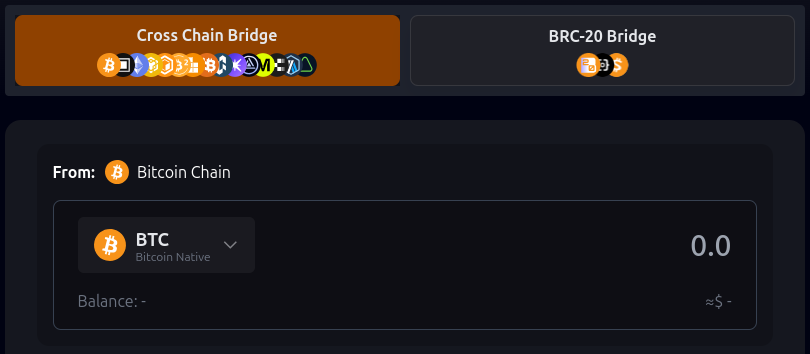
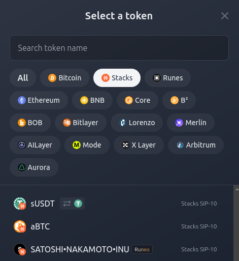
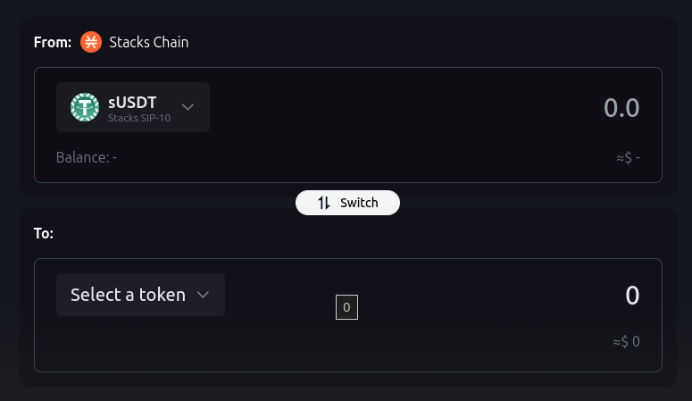
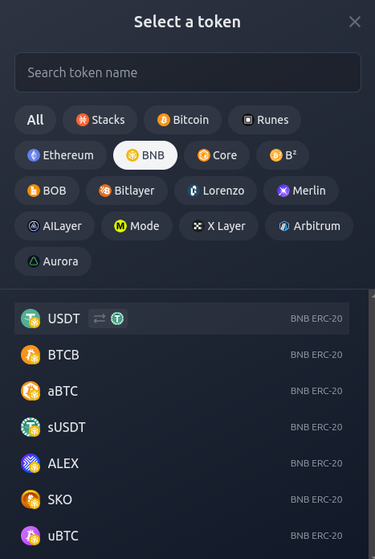
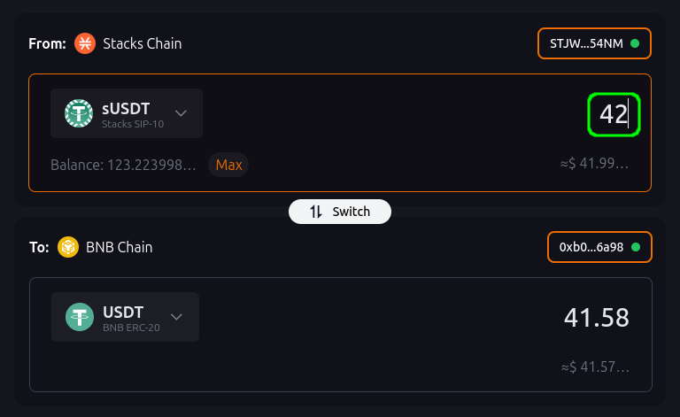
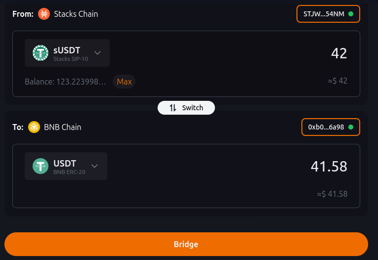
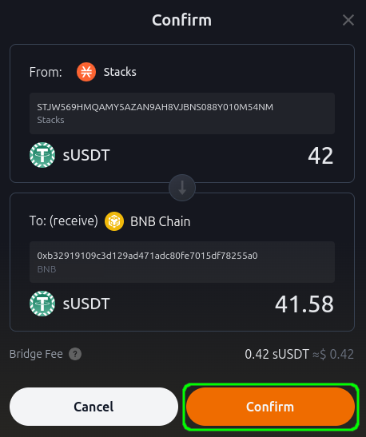
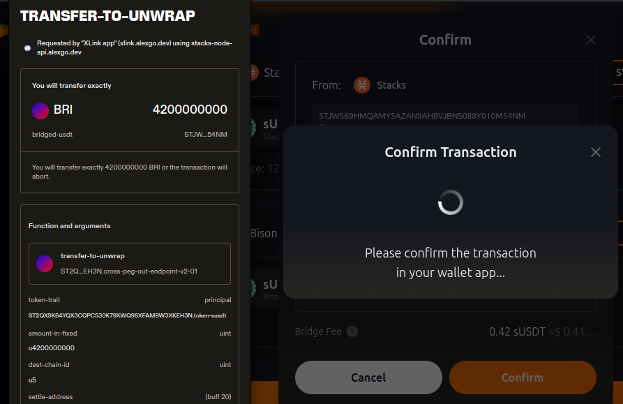
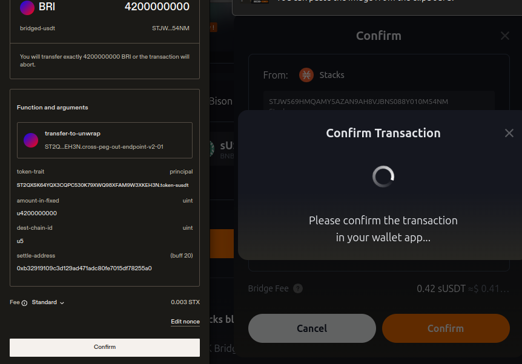

# Using the Bridge

## Connecting your Wallet

Follow these steps to connect your wallet to XLink.

### Step 1: Open the Wallet Manager

First, navigate to the **Wallet Manager** located in the top right corner of the XLink app. This is where you’ll manage all your wallet connections.

### Step 2: Choose the Blockchain and Wallet

In the Wallet Manager, select the blockchain you are using (e.g., **Stacks Chain** or **Bitcoin Chain**), then choose the wallet that you want to connect. Supported wallets include Leather, Xverse, and others as shown.

### Step 3: Enter Your Password

After selecting your wallet, you will be prompted to enter your wallet’s password.

### Step 4: Select Your Account

Once the password is entered, choose the specific account you want to connect. This account will be used for executing transactions on the bridge.

### Step 5: Confirm Your Connection

Once the wallet is successfully connected, you will notice the blockchain icon in the top right corner of the screen, confirming that your wallet has been successfully linked.

 You can connect wallets for different blockchains simultaneously (e.g., Stacks, Bitcoin, and EVM). Once connected, you will see the respective blockchain icons in the top right corner of the app. 

## Using the Bridge

Follow these steps to bridge your assets between chains using XLink.

### Step 1: Select the Source Blockchain and Token

To start, choose the blockchain from which you want to bridge your assets (e.g., **Stacks Chain**). Then, select the token you would like to bridge (e.g., **sUSDT**).

### Step 2: Select the Destination Blockchain and Token

Next, select the destination blockchain where you wish to send the assets (e.g., **BNB Chain**). Then, choose the corresponding token on this chain (e.g., **sUSDT ERC-20**).

### Step 3: Input the Amount to Bridge

Enter the amount of tokens you would like to bridge. You can also use the **Max** button to select your full balance.

### Step 4: Initiate the Bridge

After confirming the selected blockchains and token amounts, click the **Bridge** button to begin the process.

### Step 5: Confirm the Transaction

You will now be prompted to confirm the bridging transaction. Review the details and ensure everything is correct, then click **Confirm** to proceed.

### Step 6: Complete Transfer (Unwrap)

Once the bridge process begins, scroll down in the **Transfer-to-Unwrap** pop-up and confirm the additional unwrap transaction. This step is required for your tokens to be fully processed on the destination chain.

### Step 7: Wait for Confirmation

Finally, wait for the transaction to be confirmed on the blockchain. The confirmation time can take anywhere from 10 to 30 minutes, depending on network conditions. Once the transaction is broadcasted, you should see the bridged tokens deposited in your destination wallet.


You can monitor your transaction in real-time by clicking the **View in explorer** link or turning on **Telegram notifications**.


## Support

For assistance, please reach out to our Community Managers on [Discord](https://discord.com/invite/xlink) and [Telegram](https://x.com/XLinkbtc).