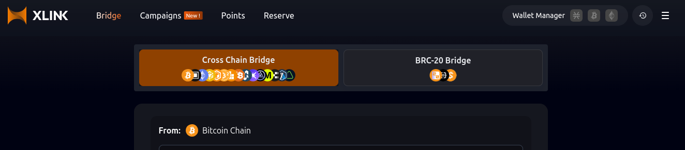
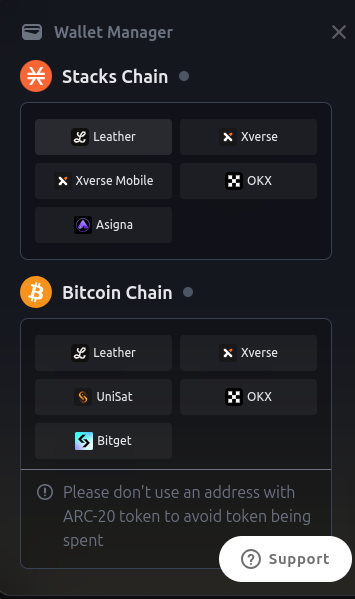
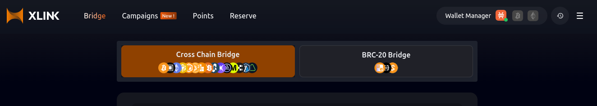

# Using the Bridge

## Connecting your Wallet

Follow these steps to connect your wallet to XLink.

### Step 1: Open the Wallet Manager

First, navigate to the **Wallet Manager** located in the top right corner of the XLink interface. This is where you’ll manage all your wallet connections.

### Step 2: Choose the Blockchain and Wallet

In the Wallet Manager, select the blockchain you are using (e.g., **Stacks Chain** or **Bitcoin Chain**), then choose the wallet that you want to connect. Supported wallets include Leather, Xverse, and others as shown.

### Step 3: Enter Your Password

After selecting your wallet, you will be prompted to enter your wallet’s password.

### Step 4: Select Your Account

Once the password is entered, choose the specific account you want to connect. This account will be used for executing transactions on the bridge.

### Step 5: Confirm Your Connection

Once the wallet is successfully connected, you will notice the blockchain icon in the top right corner of the screen, confirming that your wallet has been successfully linked.

 You can connect wallets for different blockchains simultaneously (e.g., Stacks, Bitcoin, and EVM). Once connected, you will see the respective blockchain icons in the top right corner of the interface. 

